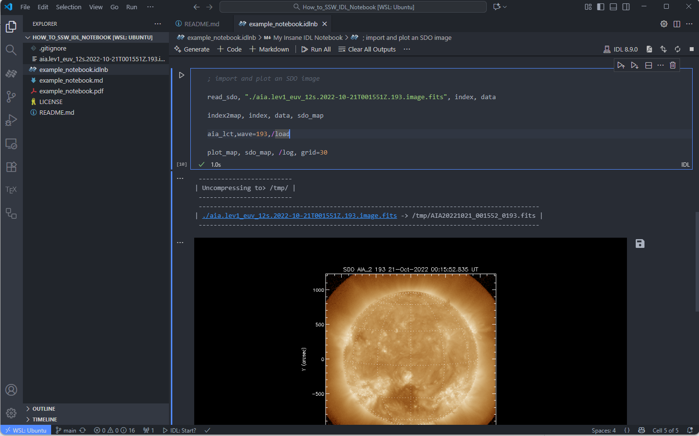

# How_to_SSW_IDL_Notebook


A dirty guide to use [IDL Notebook](https://www.nv5geospatialsoftware.com/Support/Maintenance-Detail/idl-notebooks-in-depth-tutorial) with [SolarSoft](https://soho.nascom.nasa.gov/solarsoft/).

Recently, I noticed the [IDL for VSCode](https://marketplace.visualstudio.com/items?itemName=IDL.idl-for-vscode) extension supports IDL Notebooks. This appears to be an insane idea to program IDL, which is gradually losing popularity in the solar physics community in the era of Python (avoiding `window, 0`).

However, the SolarSoftWare **(SSW)** system relies on several C shell scripts (`$SSW/gen/setup/setup.ssw` and `$SSW/gen/setup/ssw_idl`) to set up the environment variables, and build a composite `IDL_STARTUP` file for a large collection of instruments, while IDL for VSCode only supports passing known environment variables, not running C shell scripts. Therefore, I wrote this dirty trick to use SSW with IDL Notebooks. **I have only tested this on my WSL environment, may this on MacOS or Windows later.**


## Prerequisites
You already have a working installation of IDL (>=8.9), SolarSoft, and VSCode with IDL extension. If not, I recommend Dr. Peter Young's [SolarSoft Installation Guide](https://pyoung.org/quick_guides/).


## Steps
1. Start an SSW session in your terminal via `sswidl`. This will automatically set up all the necessary environment variables. 

2. In the terminal, get all the system environment variables via `$env` command. Then copy and paste the hundreds of lines of output to any LLMs and ask it to select only the necessary environment variables for SSW and format them into a JSON object for VSCode settings. For example, you can use the following prompt:
   ```
   Here is the output of $env command in my SSW session:
   <paste the output here>

   Please select only the necessary environment variables for SolarSoft and format them into a JSON object for VSCode settings idl.IDL.environment.
   ```
   You should get something like this (much longer in reality):
   ```json
    "idl.IDL.environment": {
    "AIA_CALIBRATION": "/home/yjzhu/ssw/sdo/aia/calibration",
    "AIA_CALIBRATION_DATA": "/home/yjzhu/ssw/sdo/aia/calibration/data",
    }
   ```
3. Go to VSCode setting (JSON) via `Ctrl + Shift + P` -> `Preferences: Open User Settings (JSON)`, and paste the JSON object generated by LLMs into the settings. Make sure to add a comma `,` at the end of the previous setting before pasting. Note that if you are in a **WSL** environment, choose the `Preferences: Open Remote Settings (WSL: Ubuntu)` option instead.
4. Before closing your IDL session, find the location of the IDL startup file by `getenv('IDL_STARTUP')` command in IDL. It should be something like `~/ssw_idl.xxxx`. Copy the file to a safe location because we will use it as the permanent startup file for IDL Notebooks.
5. In VSCode settings (JSON), change the `IDL_STARTUP` environment variable to point to the copied startup file. For example:
   ```json
   "idl.IDL.environment": {
       "IDL_STARTUP": "/home/yjzhu/ssw_idl_startup.pro"
   }
   ```
6. Now finally make sure in the JSON settings, the IDL directory is correctly set. For example:
    ```json
    "idl.IDL.directory": "/usr/local/harris/idl89/bin/bin.linux.x86_64",
    ```
7. Restart VSCode to make sure all settings are applied.
8. Open a new IDL Notebook and try if you can run your favorite SSW routines in the notebook. An example can be found here: [example_notebook.idlnb](example_notebook.idlnb).